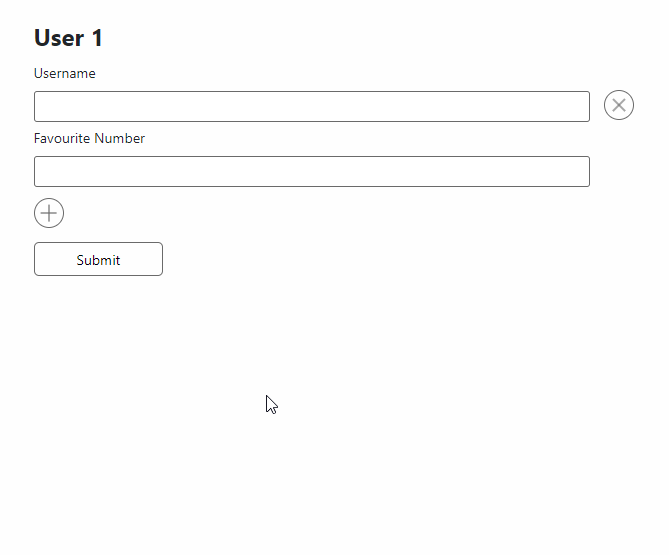

#### Helps you easily build a form with input processing, validation and formatting.
```
npm install react-superior-forms
```
#### Features include:
* [Customizable Input](#32-input)
* [Basic Inputs (Text, Email, Number, Password)](#basic-inputs)
* [Grouping](#33-inputgroup)
* [Repeaters](#34-inputgrouprepeater)
* [AJAX Submit & Loader](#35-submitbutton)
* Validation (including the displayal of messages)
* Full customization using **hooks**, **events** and **options API**
* [Form Builder API (**JSON** -> *Form*)](#4-builder-api-formbuilder)
#### Aims for customizable UI with classes, includes minimal CSS.
# 1. Introduction:
A basic form to create a user:
```JSX
import Form, {TextInput, NumberInput, SubmitButton} from 'react-superior-forms';

<Form route="/create/user" json={true}>
    <label>Username</label>
    <TextInput name="username"/>

    <label>Favourite Number</label>
    <NumberInput name="favourite_number" process={true}/>

    <SubmitButton/>
</Form>;
```
Example request:
```JS
{username: "edward_baldwin", favourite_number: 10}
```
---
## Let's put the fields into groups!
```JSX
import Form, {InputGroup, TextInput, NumberInput, SubmitButton} from 'react-superior-forms';

<Form route="/create/user" json={true}>
    <InputGroup name="user">
        <label>Username</label>
        <TextInput name="username"/>
    </InputGroup>

    <InputGroup name="user_preferences">
        <label>Favourite Number</label>
        <NumberInput name="favourite_number" process={true}/>
    </InputGroup>

    <SubmitButton/>
</Form>;
```
Example request:
```JS
{user: {username: "edward_baldwin"}, user_preferences: {favourite_number: 10}}
```
---
## Let's repeat these fields!
```JSX
import Form, {InputGroupRepeater, TextInput, NumberInput, SubmitButton} from 'react-superior-forms';

<Form route="/create/users" json={true}>
    <InputGroupRepeater name="users" entries={2} minEntries={1} maxEntries={5}>
        <label>Username</label>
        <TextInput name="username"/>

        <label>Favourite Number</label>
        <NumberInput name="favourite_number" process={true}/>
    </InputGroupRepeater>

    <SubmitButton/>
</Form>;
```
Example request:
```JS
{
    users: [
        {username: "edward_baldwin", favourite_number: 10},
        {username: "gordo_stevens", favourite_number: 22}
    ]
}
```
# 2. Format, Process, Validate
It is important to understand the concept **react-superior-forms** uses to manage the values of the inputs.
Each step is optional. **Formatting** removes all the junk from the input value. **Processing** will transform the value into the desired type. **Validating** will check whether the value passes all constraints.
\
\
For example, let's say we have a number field with all steps enabled:
```JSX
<NumberInput name="favourite_number" format={true} process={true} validate={'max:10'} defaultValue="b58a"/>
```
* Initial value: "b58a" (string)
* After formatting: "58" (string)
* After processing: 58 (number)

Now the validation can easily proceed with statement: **58 <= 10**\
Had we skipped the processing, the value would have remained a string, causing the validation to check whether the length of string **"58"** is less or equal to 10 using statement: **"58".length <= 10**\
This flow will help us re-use validations for multiple scenarios, such as arrays, strings, numbers and more!

# 3. Components
## 3.1. Form
The **<Form\/>** component, just like the native **<form\/>** element, is responsible for collecting all input data of its childrens and handling the submit event.\
The **<Form\/>** component only recognizes the [**<Input\/>**](#32-input) components as *inputs*, and will ignore all other native elements such as **<input\/>, <select\/>, <textarea\/>, etc.**\
\
The submit data is available in both *JSON* and *FormData*.
### Example usage:
```JSX
import Form from 'react-superior-forms';

<Form
    route="/user/3/update"
    method="PATCH"
    json={true}
>
...
</Form>
```
### Example rendered element:
```HTML
<form class="rsf-form">
...
</form>

or

<form class="rsf-form rsf-form--invalid">
...
any invalid input (recursively)
...
</form>
```
### Parameters:
| Parameter | Description | Type | Example value(s) | Default |
| - | - | - | - | - |
| route | The endpoint to submit the data to | string | "/example" | "/" |
| method | The method used when submitting the data | string | "GET", "POST", "PATCH", etc. | "POST" |
| json | Whether to submit the data in JSON (also sets the Content-type header to application/json) | boolean | false = submits FormData<br/>true = submits JSON | false |
| headers | The headers to send with the submitted request | object | <code>{'X-CSRF-TOKEN': csrfToken}</code> | null |
| className | The classname to append to the list of classes. | string | "my-form" | null |
| onSuccess | The function to call when the submit results in success (Status is 200) | function | (event, data) => console.log(event, data) | null | 
| onFail | The function to call when the submit results in failure (Status is not 200) | function | (event, data) => console.log(event, data) | null | 
| onSend | The function to call before sending the XHR | function | (data) => console.log(data) | null |
| onSubmit | The function to call when trying to submit | function | () => console.log('Trying to submit!') | null |
| inputDefaults | The default props the **<Input\/>** components will inherit. | object | <code>{validate : true, hideValidateMessage: true, required: true, disabled: true, process: true, format: true}</code><br/>Check out the **<Input/\>** props here. | null |

## 3.2. Input
The **<Input\/>** component is recognized as an input of the [**<Form\/>**](#31-form) component and will be included in the submitted data if the **disabled** property is not set to *false*.\
This component should only be used when creating a custom input of your own choice. A handful of inputs were already created to help you skip this process. Check out the [**basic inputs**](#basic-inputs).\
\
To create a custom input, pass your custom input component as the *component* property.\
This *component* will inherit a handful of properties passed to the **<Input\>** component (e.g. name, value, type, disabled, required, className) plus the current value of the input, and the *onChange* function which should be called whenever your input component's value has changed.

### Example usage:
```JSX
import Form, {Input} from 'react-superior-forms';

function YourCustomInputComponent(props){
    return <input type="text" disabled={props.disabled} onChange={props.onChange}/>
}

<Form>
    <Input name="custom_stuff" component={<YourCustomInputComponent/>} disabled={Math.random() >= 0.5}/>
</Form>
```
### Example output:
```HTML
<form class="rsf-form">
    <input type="text" disabled>
</form>

or if "validate" property is used, and the input is currently invalid

<form class="rsf-form rsf-form--invalid">
    <div class="rsf-input-validation-wrapper rsf-input-validation-wrapper--invalid">
        <input type="text">
        <label>Validation error message</label>
    </div>
</form>
```
### Parameters:
| Parameter | Description | Type | Example value(s) | Default |
| - | - | - | - | - |
| name | The key to use when submitting the data | string | "username" | "" |
| defaultValue | The value to initialize the input with | any | <code>"edward_baldwin", 123, [1,2,3]</code> | null |
| type | The input type. This helps in recognizing the default validator, formatter when they are set to auto (true). | "email", "password", "text", "number", "custom" | "default" |
| validate | The validation to use on the input value. When set to **true**, the validators will be recognized automatically based on the **type** and **required** properties. | boolean \| array \| function \| string | false = No validation<br/>true = The validators will be recognized based on the **type** property.<br/><br/><code>(value) => String(value).startsWith('ez')</code><br/><br/>"max:255"<br/>"between:10,20"<br/><br/><code>[{type: 'custom', assert: (value) => !value, message: () => 'Custom message!'}, 'max:10', {type: 'between', arguments: [10, 20]}]</code> | false |
| hideValidateMessage | Whether to hide the validation message or not | boolean | false \| true | false |
| format | The formatting to use on the input value. When set to **true**, the formatters will be recognized based on the **type** and **validate** properties. | boolean \| string \| function \| array | false = No formatting<br/>true = The formatters will be recognized based on the **type** and **validate** properties.<br/><br/><code>(value) => String(value).replace('a', 'b')</code><br/><br/>"max:255"<br/>"alphanumeric"<br/>"regex_discard:/[0-9]/"<br/><br/><code>['max:255', 'alphanumeric', {type: 'regex_discard', arguments: ['/0-9/']}]</code> | false |
| process | The processing to use on the input value. When set to **true**, the processing will be based on the **type** property. | boolean \| function | false = No processing<br/>true = The processing is recognized based on the **type** property.<br/><br/><code>(value) => parseFloat(value)</code> | false |
| required | Whether the field is required | boolean | false \| true | false |
| disabled | Whether the field is disabled. When set to **true** the input key will not be present in the submitted data | boolean | false \| true | false |
| onChange | The function to call when the change event occurs | function | <code>(value) => console.log(`Value changed to ${value}`)</code> | null |
| onValidate | The function to call when the validation event occurs | function | <code>(failedValidators) => console.log(failedValidators)</code> | null |
### Basic Inputs
These inputs were created to supply what the native **<input\>** elements have to offer.
List of available basic inputs:
* TextInput
* NumberInput
* EmailInput
* PasswordInput
#### Example usage:
```JSX
import Form, {TextInput, NumberInput, EmailInput, PasswordInput} from 'react-superior-forms';

const form = <Form
    route="/example"
    inputDefaults={{format: true, validate: true, process: true}}
>
    <label>Username:</label>
    <TextInput name="username" defaultValue="gordo"/>

    <label>Number:</label>
    <NumberInput name="favourite_number" defaultValue={123}/>

    <label>Email:</label>
    <EmailInput name="email" defaultValue="gordo@nasa.com"/>

    <label>Password:</label>
    <PasswordInput name="password"/>
</Form>;
```
## 3.3. InputGroup
The **<InputGroup\/>** helps you group your input values.\
The **<InputGroup\/>** will wrap all [**<Input\/>**](#32-input), **<InputGroup\/>** and [**<InputGroupRepeater\/>**](#34-inputgrouprepeater) components.\
It both stands as a wrapper component with helpful modifier classes such as  *--invalid* — and as a way to group your **key, value** pairs into a parent **key**.

### Example usage:
```JSX
import Form, {InputGroup, TextInput, NumberInput} from 'react-superior-forms';

<Form route="/create/user" json={true}>
    <InputGroup name="user">
        <label>Username</label>
        <TextInput name="name"/>
    </InputGroup>
    <InputGroup name="user_preferences">
        <label>Favourite Number</label>
        <NumberInput name="favourite_number"/>
    </InputGroup>
</Form>;
```
### Example output:
```HTML
<form class="rsf-form">
    <fieldset class="rsf-input-group input-group-name-user">
        <label>Username</label>
        <input class="rsf-input rsf-input-type-text" name="name" type="text">
    </fieldset>
    ...
</form>
```
### Parameters:
| Parameter | Description | Type | Example value(s) | Default |
| - | - | - | - | - |
| legend | The element or string to insert for the **<legend\/>** of the **<fieldset\/>**. | string \| JSX | "My group"<br/><code><span\>My <b\>fancy</b\> group!</span\></code> | null |
| className | The classname to append to the list of classes. | string | "my-group" | null |
| name | The key to group the values into | string | "users" | null |
| defaultValue | The initial values for the entries placed in the group. Does not overwrite the **defaultValue** props of children inputs if there is any | array | <code>{username: "edward_baldwin", favourite_number: 10, ...}</code> | null |
| before | The element to display before the **<fieldset\/>** element | JSX | <h1\>Buzz!</h1\> | null |
| after | The element to display after the **<fieldset\/>** element | JSX | <h1\>Buzz again!</h1\> | null |
| beforeInputs | The element to display before the inputs, in the **<fieldset\/>** element | JSX | <h1\>Buzz!</h1\> | null |
| afterInputs | The element to display after the inputs, in the **<fieldset\/>** element | JSX | <h1\>Buzz again!</h1\> | null |
## 3.4. InputGroupRepeater
The **<InputGroupRepeater\/>** helps you repeat certain groups of input values.\
The **<InputGroupRepeater\/>** wraps its children into one or multiple [**<InputGroup\/>**](#33-inputgroup) components depending on the entry count.\
It also comes with a default add button to add new entries, and a remove button to remove the current entries one by one.
### Example usage:
```JSX
<Form route="/create/users">
    <InputGroupRepeater name="users" entries={1} minEntries={1} maxEntries={5}>
        <label>Username</label>
        <TextInput name="name"/>
        <label>Favourite Number</label>
        <NumberInput name="favourite_number" validate={true} format={true} process={true}/>
    </InputGroupRepeater>
</Form>;
```
### Example output:
```HTML
<form class="rsf-form">
    <fieldset class="input-group-repeater input-group-repeater-name-users">
        <div class="rsf-input-group-repeater-entry">
            <span>
                <fieldset class="rsf-input-group input-group-name-users">
                    <label>Username</label>
                    <input class="rsf-input rsf-input-type-text" name="name" type="text" value="">
                    ...    
                </fieldset>
            </span>
            <button class="rsf-...-button-remove" .../>
        </div>
        ...
        repeated entries
        ...
        <button class="rsf-...-button-add" .../>
    </fieldset>
</form>
```
### Example visuals:

#### Parameters
| Parameter | Description | Type | Example value(s) | Default |
| - | - | - | - | - |
| legend | The legend to display for each repeated entries' **<fieldset\/>** element. | string \| function | "User" = will result in "User 1", "User 2"<br/><br/><code>(props) => <span\>My <b\>{props.index}.</b\> User</span\></code> | null |
| defaultValue | The initial values for the entries placed in the repeater. Does not overwrite the **defaultValue** props of children inputs if there is any | array | <code>[{username: "edward_baldwin", favourite_number: 10, ...}, ...]</code> | null |
| entries | The initial amount of entries to display | number | 3 | 0 |
| minEntries | The minimum amount of entries to display | number | 1 | 0 |
| maxEntries | The maximum amount of entries to display | number | 5 | 0 |
| addComponent | The component used for the *button* that is responsible for inserting a new entry | JSX | <code><button\>Add new!</button\></code\> | The default add component |
| removeComponent | The component used for the *button* that is responsible for removing an entry | JSX | <code><button\>Remove this!</button\></code\> | The default remove component |
---
## 3.5. SubmitButton
The **<SubmitButton\/>** is used as the button that fires the *onSubmit* event of the [**<Form\/>**](#31-form).
It acts as the native <code><button type="submit"\></button\></code> or <code><input type="submit"\/></code> element.
### Example usage:
```JSX
import Form, {SubmitButton} from 'react-superior-forms';

<Form route="/example">
    ...
    <SubmitButton/>
</Form>;
```
### Example output:
```HTML
<button class="rsf-submit-button" type="submit">Submit</button>
```
### Parameters:
| Parameter | Description | Type | Example value(s) | Default |
| - | - | - | - | - |
| children | The children of the **<button\>...</button\>** element. | JSX | "Submit" | "Submit" |
## 3.6. SubmitStatus
The **<SubmitButton\/>** is used to display the status text of the last submit attempt.
### Example usage:
```JSX
import Form, {SubmitStatus} from 'react-superior-forms';

<Form route="/example">
    ...
    <SubmitStatus/>
</Form>;
```
### Example output:
```HTML
<span class="rsf-submit-status rsf-submit-status--fail">Failed to submit</span>
```
# 4. Builder API, <FormBuilder\/>
The **<FormBuilder\/>** is used to transform a *JSON* into a *form*.
## Example usage:
```JSX
import {FormBuilder, InputTypes} from 'react-superior-forms';

<FormBuilder
    route="/example"
    inputGroups={[
        {
            repeater: {
                entries: 1,
                legend: 'Entry',
            },
            legend: 'My group',
            className: 'my-group',
            name: 'users',
            inputs: [
                {
                    label: 'This users\'s username',
                    name: 'username',
                    type: InputTypes.Text,
                    wrapperClassName: 'my-wrapper',
                    className: 'my-input',
                    before: <h1>Hello world!</h1>,
                    defaultValue: 'test',
                    onChange: (value) => console.log(value),
                    onValidate: (validators) => console.log(validators),
                },
                {
                    name: 'email',
                    type: InputTypes.Email,
                    defaultValue: 'info@yahoo.com',
                    className: 'email-input',
                    validate: true,
                    format: true,
                    process: true,
                },
            ],
            inputGroups: [
                {
                    legend: 'My nested input group',
                    className: 'my-nested-group',
                    name: 'sub-users',
                    inputs: [
                        {
                            label: 'Username',
                            name: 'username',
                            type: InputTypes.Text,
                            className: 'my-input',
                        },
                    ],
                },
            ],
        },
    ]}
/>;
```
Parameter documentation coming soon.

### **This repository is currently in the making. The package is not yet published.**